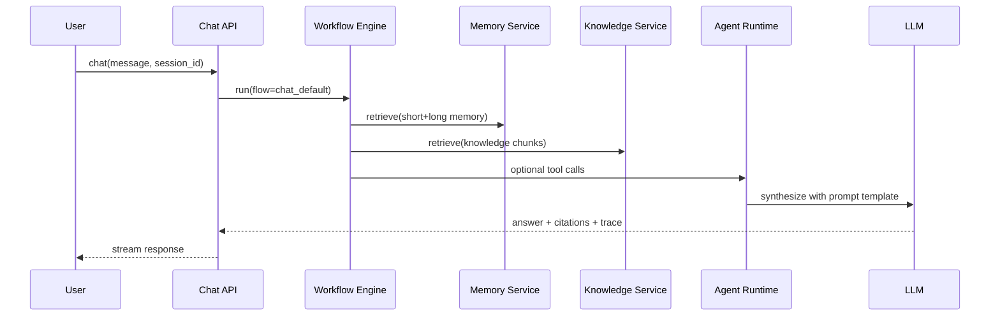
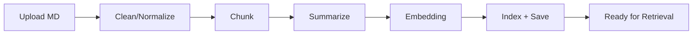
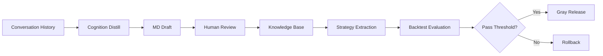

# 架构设计文档（重构版）

更新时间：2026-02-13  
文档状态：Draft v1  
适用范围：`/Users/qrh/projects/daily_stock_analysis/refactor`

---

## 1. 架构目标与范围

本文档基于 `refactor/docs/02-需求分析.md`，给出可落地的全栈重构架构方案，目标是：

1. 保留原系统核心能力（分析、回测、通知、API/Web/Bot）并完成模块化重构。
2. 引入 RAG With Memory、知识库文档管道、认知沉淀与策略提炼闭环。
3. 将分析过程升级为“可任意编排的子流程图”，且每个子流程支持 Prompt 定制。
4. 建立“策略认知 -> Prompt/流程编排优化 -> 回测评估 -> 灰度生效 -> 回滚”工程化治理机制。

架构设计覆盖以下内容：

- 模块边界与运行拓扑
- 数据模型与存储分层
- 编排引擎与 Prompt 治理设计
- 核心业务流程与接口契约
- 非功能能力与治理机制
- 迁移路线（从当前代码平滑演进）

---

## 2. 架构方案对比与决策

## 2.1 候选方案

### 方案 A：模块化单体（Modular Monolith）+ 事件驱动内核（推荐）

- 单一代码仓内维护清晰模块边界，通过接口和事件总线解耦。
- API、Worker、Scheduler 可分进程部署，但共享统一领域模型。
- 适配当前项目规模和个人维护成本，迁移风险最低。

### 方案 B：微服务拆分（Data/KB/Analysis/Chat/Notification 独立服务）

- 服务自治更强，扩展上限高。
- 运维复杂度、分布式一致性、链路排障成本显著上升。
- 对当前阶段属于过度设计。

### 方案 C：以第三方编排平台为中心（低代码工作流优先）

- 快速编排能力强，但核心能力受平台约束。
- 领域能力（回测、策略治理、通知插件）难深度定制。

## 2.2 选型结论

采用 **方案 A**：

1. 主体采用模块化单体，先确保需求闭环完整落地。
2. 保留“可拆分点”：任务队列、向量检索、知识处理、通知网关均通过接口抽象。
3. 中期按负载和演进需要拆出独立服务（优先拆 Worker 和检索服务）。

## 2.3 已确认架构决议（2026-02-13）

1. 向量库默认落地 `Chroma（单机）`，并预留 `Milvus` 适配层，后续可平滑迁移。
2. 编排框架默认采用 `LangGraph`，通过 `WorkflowEngineAdapter` 抽象隔离框架耦合。
3. 策略优化触发以“事件驱动”为主，支持人工手动触发，并支持通过 chatbot 发起修改与优化提案。
4. 前端重建独立工程，前后端完全解耦，按全栈最佳实践实施。

---

## 3. 总体架构

## 3.1 分层模型

```text
[Client Layer]
Web UI / Chatbot / OpenAPI Client / CLI
        |
[Application Layer]
API Gateway + BFF + Auth(预留) + Session Router
        |
[Orchestration Layer]
Flow Engine + Prompt Center + Agent Runtime + Policy Engine
        |
[Domain Layer]
Analysis Domain / Knowledge Domain / Memory Domain / Strategy Domain / Backtest Domain / Notification Domain
        |
[Infrastructure Layer]
RDBMS + Vector DB + Object Storage + Cache/Queue + External Providers
```

## 3.2 逻辑模块视图

1. `interaction-gateway`：统一入口（Web/API/Bot），管理会话、任务触发、SSE 推送。
2. `workflow-engine`：流程模板解析、节点调度、条件分支、失败重试、轨迹记录。
3. `prompt-center`：Prompt 模板管理、变量渲染、版本控制、灰度生效。
4. `agent-toolkit`：工具注册与调用（行情、新闻、宏观、信用、知识检索等）。
5. `knowledge-service`：文档导入、清洗、分块、摘要、向量化、引用回溯。
6. `memory-service`：短期记忆、长期记忆、历史摘要压缩策略。
7. `analysis-service`：技术面 + 宏观 + 信用 + 情绪融合与决策仪表盘生成。
8. `strategy-service`：认知沉淀、策略提炼、策略版本治理。
9. `backtest-service`：回测执行、指标汇总、策略评估打分。
10. `feedback-service`：用户反馈采集、特征构建、优化任务调度。
11. `notification-hub`：全渠道通知插件化发送与格式策略。
12. `governance-observability`：审计、指标、追踪、告警、配置中心。

## 3.3 运行时拓扑

```text
Frontend(React) ----\
Bot Connectors -------\         +----------------------+
Third-party Clients ----> API ->| App Service (FastAPI)|
                                 +----------+-----------+
                                            |
                                 +----------v-----------+
                                 | Queue / Scheduler    |
                                 +----------+-----------+
                                            |
                           +----------------v----------------+
                           | Worker (Flow + Agent + Analysis)|
                           +----------------+----------------+
                                            |
         +----------------+----------------+----------------+----------------+
         |                |                |                |                |
     Relational DB    Vector DB      Object Storage      Cache         External APIs
   (metadata/audit) (kb+memory)     (markdown/artifact) (state)     (market/news/macro)
```

---

## 4. 目录与工程结构设计（Refactor 目标）

建议在 `refactor/` 下采用如下结构：

```text
refactor/
  backend/
    pyproject.toml
    src/
      app/
        api/                    # FastAPI routers, schemas, dependencies
        orchestrator/           # workflow engine + runtime + state machine
        prompting/              # prompt templates, renderer, version manager
        agent/                  # tool registry, tool executor, intent router
        knowledge/              # ingestion pipeline + retrieval facade
        memory/                 # short/long memory service
        analysis/               # market analyzers and dashboard composer
        strategy/               # cognition distill + strategy extraction
        backtest/               # evaluation engine and metrics
        feedback/               # rating/tag pipeline and optimizer features
        notification/           # channel plugins and formatter strategy
        shared/                 # config, logging, events, errors, base models
      workers/
      scripts/
    tests/
      unit/
      integration/
      e2e/
      eval/
  frontend/
    src/
      pages/                    # chat, workflow, kb, strategy, backtest dashboards
      components/
      hooks/
      services/
  docs/
    01-全量保留功能清单.md
    02-需求分析.md
    03-架构设计文档.md
    04-详细逻辑设计文档.md
    05-项目重构实施方案.md
    06-MVP实施方案.md
    迭代开发记录/
```

---

## 5. 模块详细设计

## 5.1 Interaction Gateway（交互接入层）

职责：

1. 统一承接 Web、Chatbot、OpenAPI 请求。
2. 管理 `session_id`、`conversation_id`、`request_id`。
3. 将请求转换为流程执行任务并返回同步/异步结果。

关键设计：

- API 按领域拆分：`/chat`、`/knowledge`、`/workflow`、`/strategy`、`/backtest`、`/notifications`。
- 对话接口支持流式输出（SSE/WebSocket），并返回证据引用与工具调用轨迹。
- 与 `workflow-engine` 通过应用服务接口交互，不直接操作底层模块。

## 5.2 Workflow Engine（流程编排引擎）

职责：

1. 加载流程模板（FlowTemplate）并构建执行图。
2. 支持串行、并行、条件分支、失败重试、超时中断。
3. 记录每个节点执行轨迹与版本信息（FlowVersion + PromptVersion + ToolVersion）。

核心组件：

- `FlowTemplateRepository`
- `FlowCompiler`（模板 -> 可执行图）
- `FlowRuntime`（状态机执行）
- `NodeExecutorRegistry`（节点实现注册）
- `ExecutionTraceStore`

实现决议（默认）：

1. 采用 `LangGraph` 实现图编排执行（节点、边、条件分支、状态传递）。
2. 引入 `WorkflowEngineAdapter` 统一接口，业务侧不直接依赖 LangGraph API。
3. 节点执行器保持可测试、可替换，避免将业务逻辑写死在图框架中。

节点类型建议：

- `data.fetch.market`
- `data.fetch.macro`
- `data.fetch.credit`
- `kb.retrieve`
- `memory.retrieve`
- `llm.generate`
- `analysis.merge`
- `risk.alert`
- `report.render`
- `notification.dispatch`

## 5.3 Prompt Center（Prompt 治理中心）

职责：

1. 提供节点级 Prompt 模板管理。
2. 支持变量参数化、输出 schema 约束、版本管理。
3. 支持评估、灰度、回滚治理策略。

核心对象：

- `PromptTemplate`（模板元数据）
- `PromptVersion`（版本正文与变量声明）
- `PromptPolicy`（生效规则：按任务类型/用户组/灰度比例）
- `PromptEvalResult`（离线评估结果）

## 5.4 Knowledge Service（知识库服务）

职责：

1. Markdown 文档上传、清洗、结构化优化。
2. 分块、摘要、向量化入库。
3. 提供带引用证据的检索接口。

管道阶段：

1. `ingest`: 文件接收 + 元数据登记。
2. `clean`: 语法修复、结构规范化、链接/代码块处理。
3. `chunk`: 按标题层级 + token 阈值切块。
4. `summarize`: 块级摘要。
5. `embed`: 向量化写入 Vector DB。
6. `index`: 建立可回溯索引（chunk->doc->lineage）。

## 5.5 Memory Service（长期记忆服务）

职责：

1. 维护对话短期记忆（窗口内原文）。
2. 周期性摘要旧对话并生成记忆条目。
3. 长期记忆写入向量库并跨会话检索。

策略：

- 短期记忆：窗口条数 + token budget。
- 长期记忆：摘要后 embedding + 主题标签。
- 可配置过期策略与隐私删除策略。

## 5.6 Agent Toolkit（工具集成层）

职责：

1. 将外部能力封装成统一 Tool 协议。
2. Agent 基于意图路由动态选择工具。
3. 提供调用容错（重试、降级、熔断、兜底输出）。

Tool 协议示例：

```python
class Tool(Protocol):
    name: str
    version: str
    timeout_sec: int
    def invoke(self, payload: dict, context: dict) -> dict: ...
```

## 5.7 Analysis Service（分析域）

职责：

1. 保留并增强现有技术分析能力（MA、量能、筹码、TA-Lib 指标）。
2. 汇聚宏观、信用、舆情多源因子。
3. 生成结构化“决策仪表盘”输出。

输出标准：

- 统一 JSON schema（可供回测直接消费）。
- 面向阅读的文本摘要（可按渠道格式化）。

## 5.8 Strategy Service（认知沉淀与策略提炼域）

职责：

1. 从 chatbot 多轮对话提炼核心认知，形成 MD 草稿。
2. 支持人工审核后入库。
3. 从知识库提炼分析策略/交易策略。
4. 策略版本管理并反哺编排策略与 Prompt。

闭环：

`Conversation -> CognitionMemo -> StrategyArtifact -> Backtest -> Policy Update`

## 5.9 Backtest Service（回测评估域）

职责：

1. 保留现有回测能力并兼容新报告结构。
2. 输出方向正确率、收益率、命中率、回撤等指标。
3. 为 Prompt/流程策略生效提供“评估闸门”。

MVP 约束：

- 回测模块必须在 MVP 中可用（历史口径 F31/F32）。

## 5.10 Feedback Service（反馈优化域）

职责：

1. 收集用户反馈（评分/标签/备注）。
2. 结合回测结果构建优化特征。
3. 触发 Prompt 与编排策略优化任务。
4. 支持事件驱动触发、人工触发、chatbot 触发三种优化入口。

优化评分建议：

`quality_score = 0.45 * backtest_score + 0.35 * user_feedback + 0.20 * stability_score`

触发策略（已确认）：

1. 事件驱动：`strategy.evaluation.completed`、`feedback.recorded`、`analysis.report.generated` 等事件触发优化。
2. 人工触发：提供 API 与控制台按钮执行“重评估/重提炼/重发布”。
3. chatbot 触发：用户在对话中提交优化意图，系统生成 `ChangeProposal`，评估通过后进入实施。
4. 安全闸门：chatbot 触发的变更默认不自动生效，必须通过评估和人工确认。

## 5.11 Notification Hub（通知中心）

职责：

1. 全渠道保留（企微/飞书/TG/邮件/Discord/自定义等）。
2. 通道插件化，不修改核心编排引擎即可新增渠道。
3. 渠道格式策略化（markdown 方言、长度限制、分片策略）。

插件接口示例：

```python
class NotificationChannelPlugin(Protocol):
    channel: str
    def send(self, message: dict, context: dict) -> bool: ...
```

## 5.12 Governance & Observability（治理与可观测）

职责：

1. 端到端 Trace：请求 -> 流程 -> 节点 -> 工具 -> 输出。
2. 审计日志：策略/Prompt/流程版本变更可追溯。
3. 质量看板：成功率、延迟、引用质量、回测表现、反馈趋势。

---

## 6. 数据架构设计

## 6.1 存储分层

1. 关系型数据库（SQLite/PostgreSQL）
   - 任务、配置、版本、审计、回测、反馈、策略元数据。
2. 向量数据库（默认 Chroma，扩展 Milvus）
   - 文档 chunk 向量、长期记忆向量、策略语义索引。
   - `dev/staging` 默认 Chroma；`prod` 根据规模切换至 Milvus。
3. 对象存储（本地 FS/MinIO/S3）
   - 原始文档、优化文档、策略文档、导出报告。
4. 缓存与队列（Redis）
   - 异步任务、会话短缓存、流程状态、幂等键。

## 6.2 核心实体（需求映射）

- `KnowledgeDocument`
- `KnowledgeChunk`
- `ConversationSession`
- `ConversationMessage`
- `MemorySummary`
- `CognitionMemo`
- `StrategyArtifact`
- `FlowTemplate`
- `FlowNode`
- `PromptTemplate`
- `OrchestrationPolicy`
- `AnalysisResult`
- `BacktestResult`
- `FeedbackRecord`

## 6.3 数据生命周期

1. 文档和会话数据进入热层（7~30 天高频访问）。
2. 周期摘要与归档后进入冷层（长期知识）。
3. 模型升级时支持向量重嵌入与索引重建。
4. 支持按用户配置执行数据清理与审计保留策略。

---

## 7. 核心流程设计

## 7.1 Chat + RAG + Memory 流程



## 7.2 Markdown 一键导入流程



## 7.3 认知沉淀与策略提炼流程



## 7.4 分析任务与通知流程

1. 用户发起个股/大盘分析请求。
2. 编排引擎按模板执行数据采集、因子提取、综合推理。
3. 生成结构化决策仪表盘（JSON + 文本）。
4. 回写分析记录并触发回测候选标记。
5. 按通知策略路由到全部已配置渠道。

## 7.5 策略优化触发流程（事件驱动 + 人工 + Chatbot）

1. 事件总线接收回测完成、反馈新增、策略评估完成事件。
2. 优化引擎评估是否达到触发阈值，满足则创建优化任务。
3. 用户可在控制台或 chatbot 发起手动优化任务。
4. chatbot 指令转为 `ChangeProposal`，写入待评估队列。
5. 仅当“离线评估通过 + 人工确认”后，才允许灰度发布。

---

## 8. 流程编排 DSL 与 Prompt 规范

## 8.1 FlowTemplate（YAML 示例）

```yaml
flow_id: stock_analysis_v1
version: 1.2.0
entry: node_fetch_market
nodes:
  - id: node_fetch_market
    type: data.fetch.market
    timeout_sec: 10
    retry: {max_attempts: 2, backoff: 2}
    next: [node_fetch_macro, node_fetch_credit]
  - id: node_fetch_macro
    type: data.fetch.macro
    timeout_sec: 8
    next: [node_merge]
  - id: node_fetch_credit
    type: data.fetch.credit
    timeout_sec: 8
    next: [node_merge]
  - id: node_merge
    type: analysis.merge
    prompt_ref: prompt.analysis.merge@3
    next: [node_risk_alert]
  - id: node_risk_alert
    type: risk.alert
    prompt_ref: prompt.risk.alert@5
    next: [node_render]
  - id: node_render
    type: report.render
    prompt_ref: prompt.report.render@2
    next: [node_notify]
  - id: node_notify
    type: notification.dispatch
    config: {channels: ["all_enabled"]}
```

## 8.2 PromptTemplate（JSON 示例）

```json
{
  "prompt_id": "prompt.analysis.merge",
  "version": 3,
  "role": "system",
  "goal": "生成结构化决策仪表盘并给出风险解释",
  "constraints": [
    "必须输出 JSON schema v2",
    "必须包含证据引用和不确定性说明"
  ],
  "variables": ["stock_code", "technical_factors", "macro_factors", "credit_factors", "sentiment_factors"],
  "output_schema": "analysis_dashboard_v2"
}
```

## 8.3 编排与 Prompt 治理策略

1. 版本不可变：已发布版本只读。
2. 变更先评估：新版本必须通过离线评估。
3. 灰度发布：按任务类型或用户分组控制流量。
4. 可回滚：失败立即恢复上一稳定版本。
5. 全程可追踪：每次分析记录 `flow_version + prompt_versions`。

---

## 9. 接口与事件契约

## 9.1 内部服务接口

- `WorkflowService.run(flow_id, input, policy_ctx) -> execution_id`
- `PromptService.render(prompt_id, version, variables) -> rendered_prompt`
- `KnowledgeService.ingest(doc) -> job_id`
- `KnowledgeService.retrieve(query, top_k, filters) -> chunks`
- `MemoryService.summarize(session_id) -> summary_id`
- `StrategyService.extract(source_scope) -> strategy_version`
- `BacktestService.evaluate(strategy_version) -> report`
- `NotificationService.dispatch(message, channels) -> delivery_report`

## 9.2 领域事件（事件总线）

- `knowledge.document.ingested`
- `conversation.cognition.distilled`
- `strategy.version.created`
- `strategy.evaluation.completed`
- `policy.rollout.started`
- `policy.rollout.rolled_back`
- `analysis.report.generated`
- `notification.delivery.completed`

---

## 10. 非功能架构落实

## 10.1 性能

1. 任务执行异步化，耗时节点并行执行。
2. 工具调用设置超时、缓存与降级策略。
3. 向量检索与摘要任务支持批处理和重试。

## 10.2 可靠性

1. 幂等键防止重复执行（请求级和任务级）。
2. 失败节点重试与补偿逻辑。
3. 外部依赖不可用时使用降级模板输出。

## 10.3 可观测性

1. OpenTelemetry Trace + 结构化日志。
2. 指标：P95 延迟、成功率、检索命中率、回测分数、反馈分布。
3. 节点级执行耗时和错误归因。

## 10.4 安全

1. 密钥统一走环境与密钥管理，不写日志明文。
2. 文档和会话数据支持按策略删除。
3. 关键策略变更支持人工审批开关。

---

## 11. 测试与验收设计

## 11.1 测试分层

1. 单元测试：节点执行器、Prompt 渲染器、策略评分器。
2. 集成测试：知识导入链路、RAG 检索、回测流程。
3. 端到端测试：聊天问答 -> 引用证据 -> 报告输出 -> 通知分发。
4. 评估测试：Prompt/流程版本离线评测集（准确性与稳定性）。

## 11.2 核心验收门槛（建议）

1. 所有 P0 流程具备自动化回归用例。
2. 回测模块与新报告 schema 100% 兼容。
3. 流程版本和 Prompt 版本可追踪到单次执行。
4. 新策略未通过评估时不得自动全量生效。

---

## 12. 部署架构

## 12.1 环境分层

1. `dev`：单机部署（FastAPI + Local Worker + SQLite + Chroma）。
2. `staging`：多进程部署（PostgreSQL + Redis + Chroma，验证 Milvus 迁移能力）。
3. `prod`：高可用部署（API/Worker 分离，Milvus 集群可选或按规模启用）。

## 12.2 部署单元

- `app-api`: 对外 API 与会话入口。
- `app-worker`: 流程执行、知识处理、策略提炼、回测任务。
- `app-scheduler`: 周期任务（总结、重评估、归档）。
- `frontend-web`: 聊天与运营控制台。

---

## 13. 迁移架构路线（从现有代码到目标架构）

## Phase 0：兼容层准备（低风险）

1. 现有 `src/core/pipeline.py` 封装为 `legacy_analysis_adapter`。
2. 现有 `src/notification.py` 拆出统一 `channel_plugin` 接口。
3. 保留现有 API，对外行为不变。

## Phase 1：编排引擎落地

1. 引入 `workflow-engine` 和流程模板仓储。
2. 将现有分析主流程改为“节点化执行”。
3. 记录执行轨迹与版本信息。

## Phase 2：知识与记忆能力落地

1. 完成 Markdown 导入管道与向量检索。
2. 落地 RAG With Memory 聊天接口。
3. 支持对话摘要压缩与长期记忆。

## Phase 3：认知沉淀与策略闭环

1. 上线 CognitionMemo 草稿与审核流程。
2. 上线 StrategyArtifact 提炼与版本管理。
3. 接入回测评估与灰度发布策略。

## Phase 4：全链路治理完善

1. Prompt/流程版本治理自动化。
2. 反馈特征驱动策略优化。
3. 构建质量看板与审计中心。

## Phase 5：前端独立重建

1. 创建独立前端工程（与后端仓内模块解耦）。
2. 建立聊天、知识库、流程编排、策略治理、回测看板五大页面。
3. 与后端通过 OpenAPI 契约联调，形成独立发布流水线。

---

## 14. 当前代码映射关系（关键文件）

以下文件将作为迁移输入，不直接在原目录大改：

1. 分析总线：`src/core/pipeline.py`
2. 分析服务：`src/services/analysis_service.py`
3. 回测服务：`src/services/backtest_service.py`
4. 任务队列：`src/services/task_queue.py`
5. 数据源适配：`data_provider/base.py`
6. 通知实现：`src/notification.py`
7. API 入口：`api/app.py`
8. 分析接口：`api/v1/endpoints/analysis.py`

重构实现将落在 `refactor/`，原目录仅用于能力对照与迁移验证。

---

## 15. 架构输入清单闭环确认（对应 02 文档第 13 节）

1. 模块边界与数据契约：已定义（第 3、5、9 节）。
2. RAG+Memory 融合策略：已定义（第 5.4、5.5、7.1 节）。
3. Agent 工具编排与降级：已定义（第 5.6、10 节）。
4. 认知抽取与审核沉淀：已定义（第 5.8、7.3 节）。
5. 策略提炼与版本治理：已定义（第 5.8、8.3 节）。
6. 编排 DSL 与版本治理：已定义（第 8.1、8.3 节）。
7. 子流程 Prompt 治理：已定义（第 5.3、8.2、8.3 节）。
8. 回测反馈优化闭环：已定义（第 5.9、5.10、7.3 节）。
9. 通知插件体系：已定义（第 5.11 节）。
10. 平滑迁移路径：已定义（第 13、14 节）。

---

## 16. 已确认实施决策（进入详细设计前）

1. 向量库：默认 `Chroma（单机）`，保留 `Milvus` 扩展与迁移能力。
2. 编排框架：默认 `LangGraph`，通过 `WorkflowEngineAdapter` 保持可替换。
3. 优化触发：默认“事件驱动”，同时支持手动触发和 chatbot 发起优化提案。
4. 生效控制：chatbot 发起的优化必须“评估通过 + 人工确认”后才实施。
5. 前端路线：重建独立前端工程，前后端完全解耦重构。

以上决策已固化为架构输入，下一阶段进入模块级详细逻辑设计。
